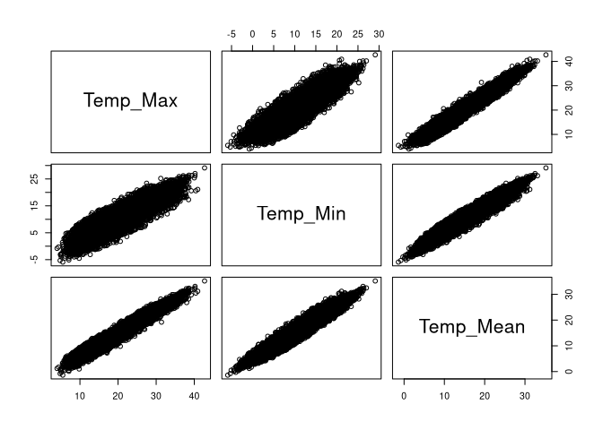
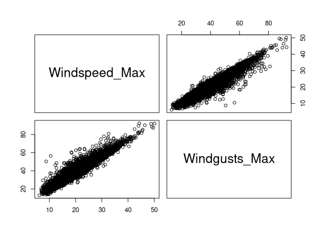
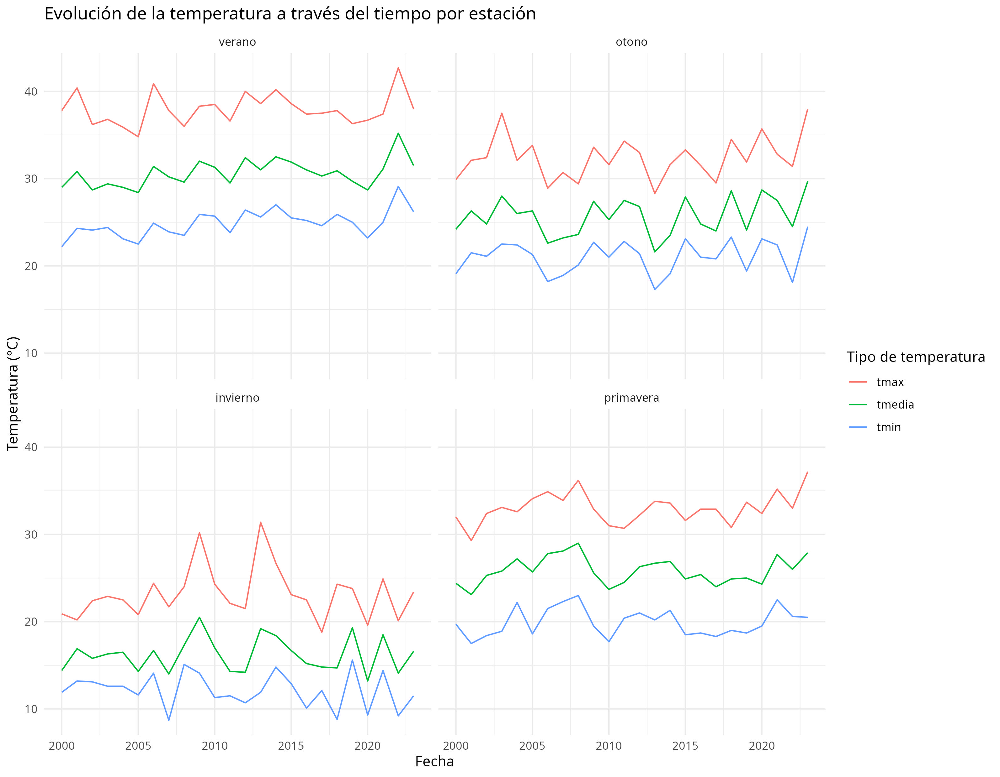
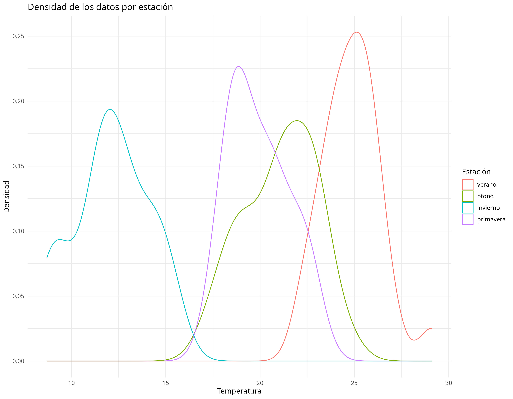

Analisis_atmosferico_Argentina.Rmd
================
Paine Plez
2025-10-28

## Descripcion

Este proyecto analiza aproximadamente 20 años de datos atmosféricos a
partir de un dataset de kaggle que no especifica que estación
meteorológica registro los datos. El objetivo es explorar patrones
climáticos, la correlación ente algunas de sus variables, evaluar la
variabilidad climática y verificar si los datos son reales o simulados.
Este análisis forma parte de mi portfolio para mostrar mis habilidades
en R.

## Objetivo

Mostrar mi progreso en el aprendizaje de R, incluyendo: Manejo de
datasets, Análisis de datos, Visualización y Automatización con scripts

## Datos

El proyecto incluye un script de zsh para descargar los datos. El mismo
requiere kaggle CLI (pip install kaggle) y un archivo JSON de kaggle
(usuario y API kEY).

El dataset Tambien esta disponible en
<https://www.kaggle.com/datasets/minahilfatima12328/argentina-atmospheric-data>

## Tecnologías usadas

para descargar el archivo: zsh con kaggle CLI para el análisis: R con
las librerías: tidyverse, broom, ggmap, readr, lubridate, naniar, trend,
tseries, boot, moments

## Resumen del analisis realizado

## datos faltantes

    ##              Date          Temp_Max          Temp_Min         Temp_Mean 
    ##                 0                 0                 0                 0 
    ## Precipitation_Sum     Windspeed_Max     Windgusts_Max Sunshine_Duration 
    ##                 0                 0                 0                 0

no hay valores nulos en ninguna variable

## estadistica descriptiva

| variable  | media   | mediana   | st desvia  | 1 cuartil   | 3 cuartil |
|----------:|--------:|----------:|:-------------------------|:----------|
|    t_min  |  10.75  |   10.8    |    6.08    |    6.2      |   15.7    |
|    t_max  |  21.45  |   21.3    |    7.25    |    15.6     |   27.1    |
|----------:|--------:|----------:|:-------------------------|:----------|

    ## El rango de temperaturas es 48.6

## Correlacion de variables

|           | Temp_Min | Temp_Max | Temp_Mean |
|:----------|---------:|---------:|----------:|
| Temp_Min  |     1.00 |     0.90 |      0.97 |
| Temp_Max  |     0.90 |     1.00 |      0.97 |
| Temp_Mean |     0.97 |     0.97 |      1.00 |

Correlacion positiva temperatura

|               | Windspeed_Max | Windgusts_Max |
|:--------------|--------------:|--------------:|
| Windspeed_Max |          1.00 |          0.96 |
| Windgusts_Max |          0.96 |          1.00 |

Correlación positiva vientos

Correlacion positiva temperatura

Correlación positiva vientos

Se observa fuerte correlacion positiva en las variables de temperatura
maxima, media y minima.  
Tambien fuerte correlacion entre velocidad maxima del viento y la
velocidad maxima de las rafagas de viento.

## Evolucion de la temperatura a traves del tiempo por estacion

Se observa una ligera tendencia de aumento de temperatura

| statistic | p.value | parameter | method                  | alternative | var       |
|----------:|--------:|----------:|:------------------------|:------------|:----------|
|     -0.15 |    0.88 |      8766 | Mann-Kendall trend test | two.sided   | Temp_Min  |
|      0.87 |    0.38 |      8766 | Mann-Kendall trend test | two.sided   | Temp_Max  |
|      0.30 |    0.76 |      8766 | Mann-Kendall trend test | two.sided   | Temp_Mean |

Resultados de la prueba de Mann-Kendall por variable

No se confirma como tendencia por regrecion lineal ni por Mann-Kendall
en temperatura media s=0.30 indica tendencia positiva (aumento de la
temperatura),  
p=0.76 \> 0.05 no se confirma como tendencia (podría ser una casualidad)

## Densidad de los datos por estacion

 Se
observan curvas suaves

## Valores atípicos en 20 años

    ## 8  valores fuera del rango intercuartilico en la variable temperatura minima

## Próximos pasos

### Reforzar la hipótesis 4 sobre la naturaleza de los datos

- Profundizar en el análisis a todo el dataset

- Comparar con datos provistos por alguna entidad del propio país
  intentar localizar el lugar especifico de donde vienen los datos, o si
  son un promedio general de todo el territorio argentino

## Contacto

¿Te interesa este análisis o tenes sugerencias? ¡Contactame!

Email: <paineplez@gmail.com> GitHub: \<github.com/eutopial\>
